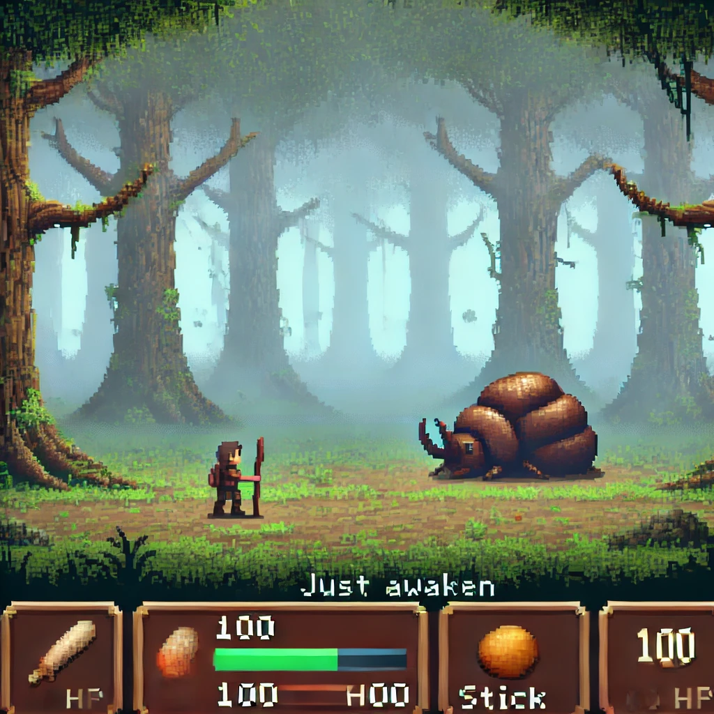
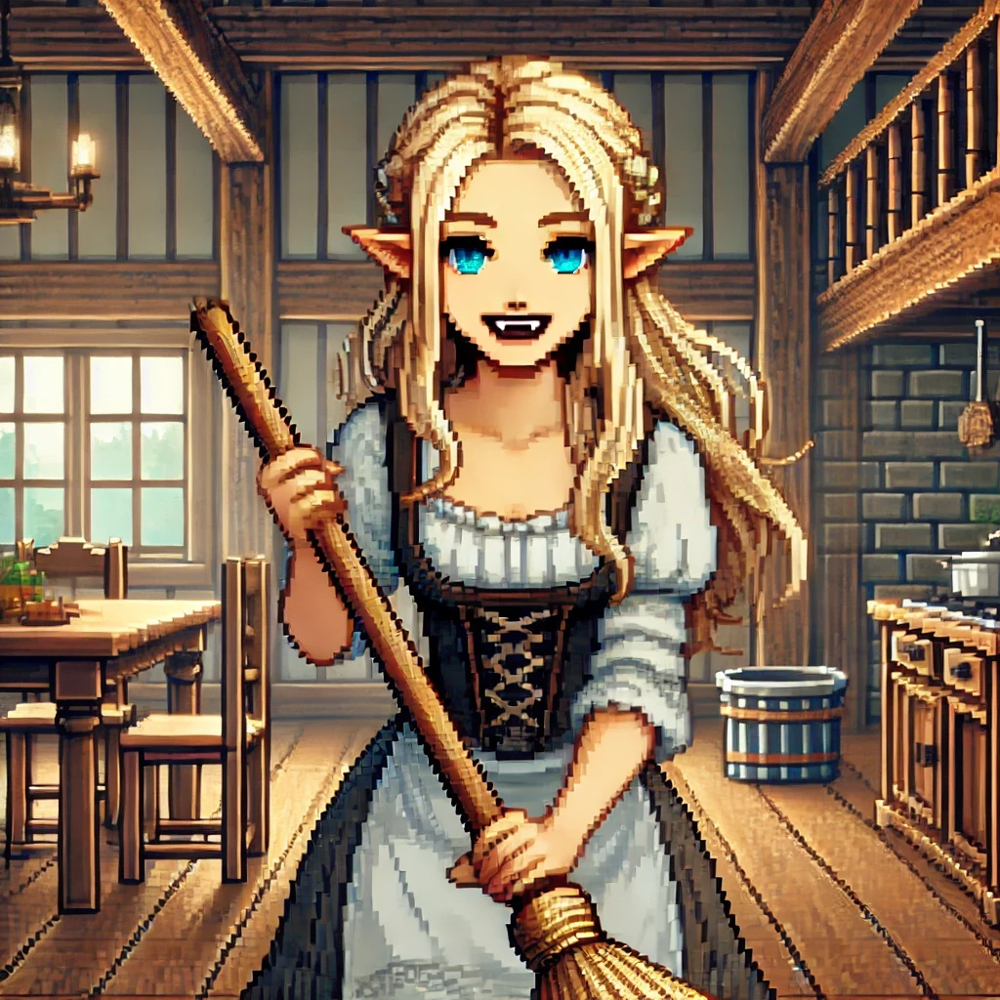
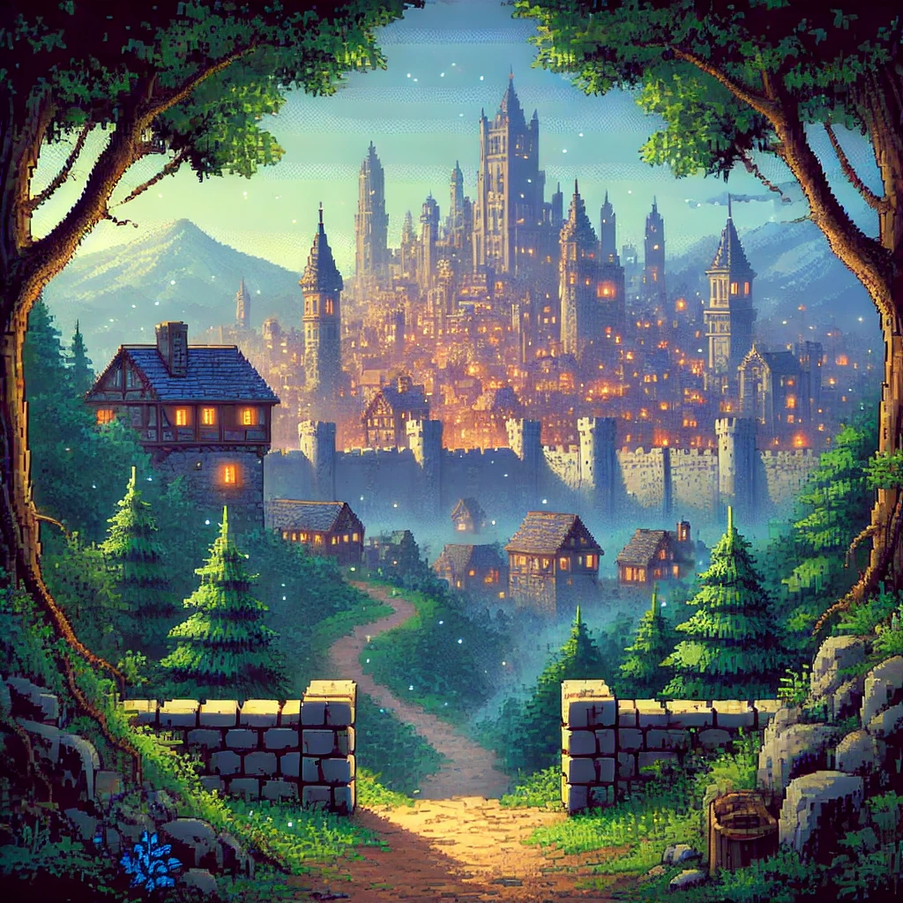
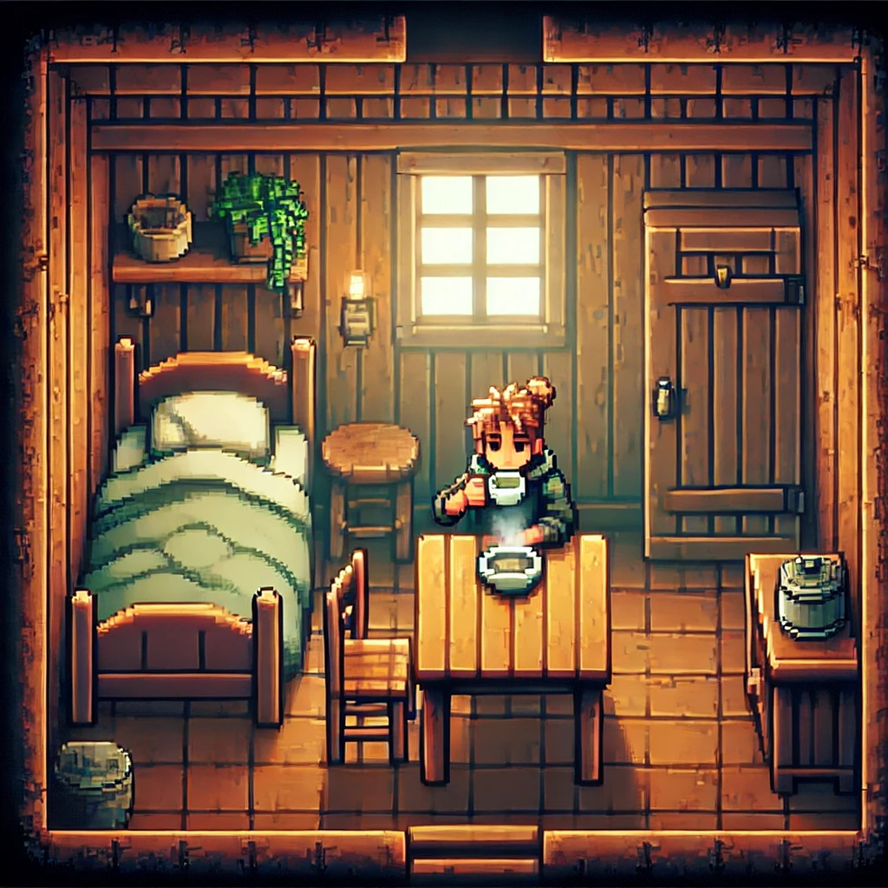
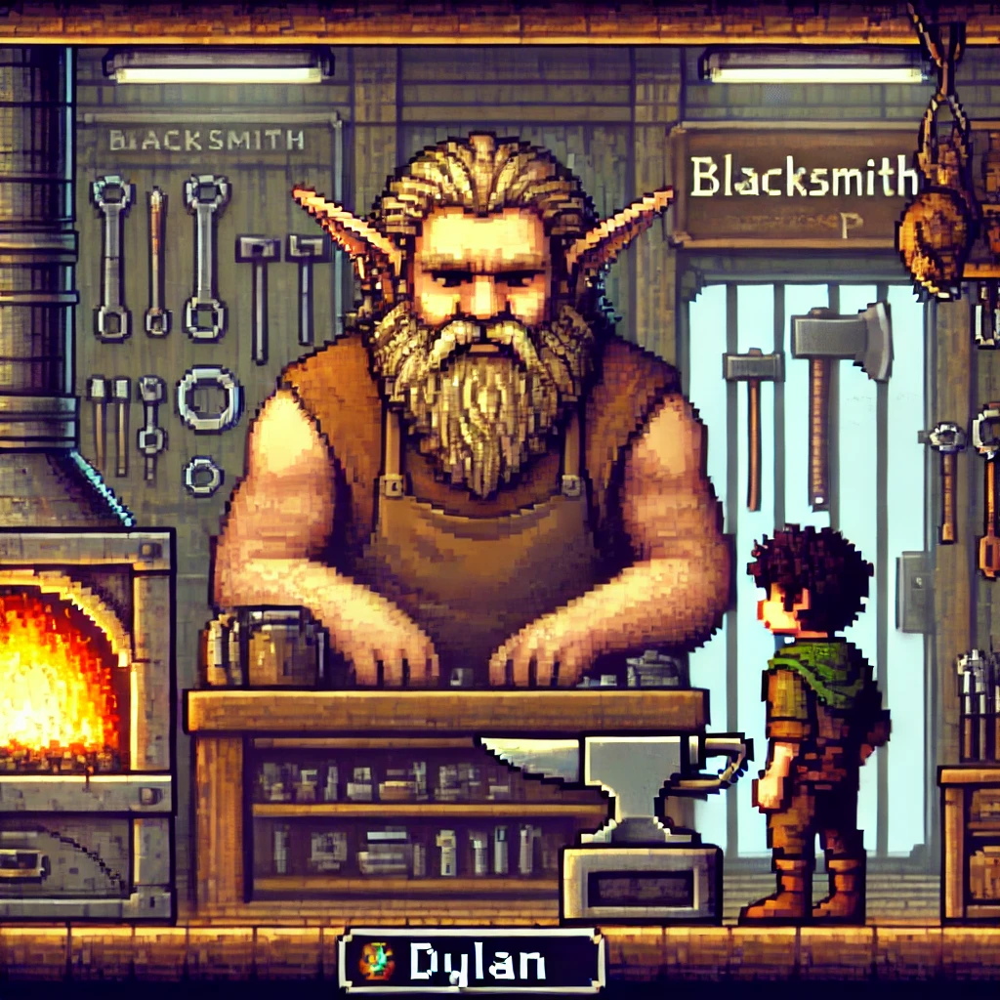
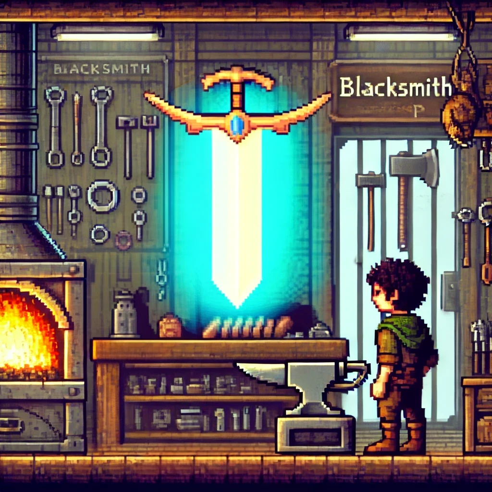

# The Journey Never Ends Adventure Game

## Description:

The Journey Never Ends is a text-based adventure game where players embark on a journey through a mystical forest, encountering enemies, making decisions, and managing their inventory. The game offers players the opportunity to explore the story while managing their health and gold, acquiring items, and interacting with NPCs. Additionally, an admin menu provides options to manage game data, view player statistics, and clear past game data.

## Features:

**Player Stats Management**: Track your health and gold throughout the game.
**Inventory System**: Manage weapons and food items, consume food to regain health.
**Story-Based Choices**: Make decisions that impact the progression of the story.
**Admin Menu**: Includes options to view characters, manage game data, and clear past games.
**SQL Database Integration**: Player and item data are stored and managed using SQLite.

## Installation:

1. **Clone the repository:**

git clone <repository-url>
cd your-repo-folder

2. **Install Dependencies:**

    - Ensure you have Python 3 installed.
    - Install required dependencies using the provided Pipfile (if you have pipenv):
pipenv install
pipenv shell
If you are not using pipenv, you can install dependencies manually:

pip install sqlite3

3. **Run the Game:**

python lib/cli.py

## Usage

The game starts by asking for the player's name, followed by a menu where you can choose different actions:

- **Check Player Stats:** View your health, gold coins, and inventory.
- **Continue Story:** Progress through the story and encounter challenges or collect items.
- **Restart Game:** Restart the game with default stats (100 HP, 100 Gold, Stick weapon).
Additionally, there is an *Admin Menu* that provides options to manage the game data.

## Game Instructions

Upon launching the game, you will be presented with a menu. You will use this menu to navigate through the game, check your stats, continue your adventure, and access the admin menu.

## Main Menu Options:
**Check Player Stats:** View your current health points, gold coins, and items in your inventory. You can also consume food to restore health.
**Continue Story:** Progress through the story, encounter challenges, make decisions that affect your fate, and collect new items.
**Restart Game:** Reset the game to its initial state, starting with 100 health points, 100 gold coins, and a basic weapon (Stick).
**Admin Menu:** Access additional features for managing game data, including viewing all characters and items, and clearing the database.

## Admin Menu:
The admin menu is designed for advanced game management. Only available from the main menu, this allows you to manage the database and view all stored data.

## Admin Features
To access the admin features, choose "Admin Menu" from the main menu.

## Admin Menu Options: 
- **Clear Past Games:** Clears all characters and items from the database.
- **List All Characters:** View all characters stored in the database.
- **Find Character by ID:** Search for a character by their ID.
- - **List All Items:** View all items stored in the database.
**Find Item by ID:** Search for an item by its ID.

## Playing the Game:
- **Fight or Flee:** Throughout the game, you will encounter enemies like a human-sized dung beetle. You can choose to fight, flee, or use an item from your inventory to restore health and continue battling.
- **Inventory Management:** Collect items such as weapons and food. You can use food to restore health, and better weapons increase your chances of success in combat.
- **Make Story Decisions:** The game offers branching paths where your choices affect the outcome of your journey. Your decisions will lead you through unique encounters and influence your progress.

## File Structure
|-- game/
|   |-- lib/
|       |-- cli.py  # Main game logic and menus
|       |-- helpers.py  # Helper functions like exit_program
|   |-- models/
|       |-- __init__.py  # Database setup and table creation
|       |-- characters.py  # Character class and ORM methods
|       |-- items.py  # Item class and ORM methods
|-- Pipfile  # Dependencies for the project
|-- README.md  # Documentation for the project

## Acknowledgments
This project was built by Bre Humphres. Special thanks to my instructor, Sakib, and peers for guidance.

*Take a look at some AI images that give a visual element to the game!*

